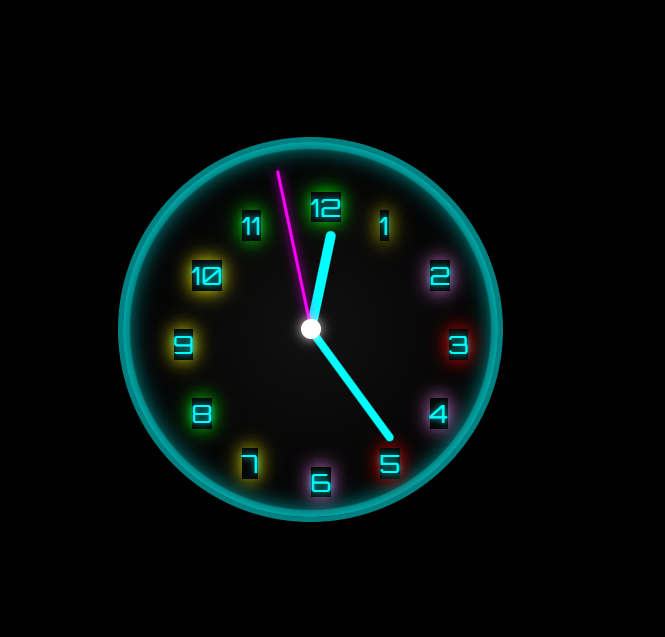

# 🔒 Secret Clock Lock

A futuristic clock-based “combination lock” that challenges users to align symbols to unlock a hidden message.

<p align="center">
  
</p>

## Features

- **12-position clock face** with a spinning outer ring  
- **4 glow-colors** (red, violet, green, yellow) randomly reassigned every 5 seconds  
- **Color-based symbol sets**:  
  - Red: `! @ # $`  
  - Violet: `% ^ & *`  
  - Green: `( ) - =`  
  - Yellow: `+ < > ?`  
- **Cycle on click**: each glowing digit toggles through its color’s symbols  
- **Single target symbol** (picked at random) that must occupy all 12 spots  
- **Click counter** & **correct-count** logged to console  
- **Custom “success” modal**:
  > _taidan sit joutuu tulee pelaaman :(_  
  > _onnittelut koodin aukaisusta!_  
- **View-source blocking**: right-click & DevTools keys disabled with a playful alert

## ⚙️ Settings

At the **very top** of your `script` (or in a dedicated `config.js`), include:

```js
const CONFIG = {
  colorInterval:    5000,          // how often (ms) to reshuffle glow‐colors
  blinkInterval:    60000,         // how often (ms) to blink the target symbol in the background
  blinkCount:       5,             // how many times to blink when scheduled
  onSuccess:        'message',     // 'message' | 'login' | 'callback'
  successMessage:   'taidan sit joutuu tulee pelaaman :(\nonnittelut koodin aukaisusta!',
  instructionsText: 'Klikkaa värejä, kun symbolit ovat kohdillaan…',
  // If you prefer a real login form, swap onSuccess to 'login' and see the "Implementing Login" tip below.
};```
Tip: you can also pass ```js onSuccess: (targetSymbol) => { /* your custom callback */ }```
to run arbitrary code when the puzzle is solved.

## Demo

1. Clone or download the repository.  
2. Open `index.html` in your browser.  
3. Watch the clock glow and spin.  
4. Click each glowing digit to cycle its symbol.  
5. When **all 12** show the same target symbol, the final message appears!

## Usage

```bash
git clone https://github.com/Lovsan/secret-clock-lock.git
cd secret-clock-lock
open index.html
